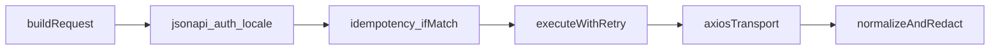

# Agent runbook: `@vahidkaargar/customized-api-client`

**Canonical spec:** This file ([`.cursor/tasks/project-plan.md`](project-plan.md)) is the **only** implementation runbook for this package. **[`AGENTS.md`](../../AGENTS.md)** and **[`.cursorrules`](../../.cursorrules)** point here.

**Objective:** Ship a TypeScript **Axios** client for **JSON:API v1.1** under **`/api/v1`**, with **Bearer auth** (user token + optional partner key), **mandatory idempotency on mutations**, **optimistic concurrency (`If-Match` / `ETag` / `meta.version`)**, **full HTTP/status normalization**, **retries** (explicit allow/deny table), **structured outputs**, **frontend ergonomics** (pagination incl. legacy link query params, locale, query DSL, `included`, form errors, **`getByUrl`**, **`getNextPageUrl`**), and **security hygiene**. Use **standard symbol names** only (`createApiClient`, `ApiClientError`, etc.—no product tokens in code or exports).

---

## A. Locked decisions (enforce in code, README, defaults)

These replace ad-hoc “pick one” choices; **document in README**.

| Topic | Decision |
|--------|-----------|
| **Default `baseURL` / docs** | **Mode B:** `baseURL` includes **`/api/v1`**; paths like `/admin/teams`. **Mode A** (origin-only + prefix) via **`pathStyle`** / config (see §3). |
| **Default error style** | Verb methods **throw `ApiClientError`** on failure. **Also export** `safeGet` / `safePost` / … or **`requestSafe`** returning **`Result`/`ClientResult`** with **`Err` = `ApiClientError`**. README: **try/catch first**, **`safe*`** second. |
| **Server status “precedence”** | **Server-side only.** Client **never** simulates precedence chains. Classify from **actual HTTP status** + **`errors[].code`** on that response. |
| **OpenAPI** | Spec: **`openapi/v1.yaml`** (backend/monorepo). **`package.json` script** + **`OPENAPI_PATH`**. **Commit `src/generated/openapi.ts`** or **fail CI** for production—no silent skip. **Never hand-edit** generated file; re-export selected types only. |
| **Pagination** | **Outgoing:** `page[number]`/`page[size]`, `page[cursor]`/`page[size]` per OpenAPI. **Incoming:** parse **`meta` + `links`**; tolerate **legacy `page` / `per_page`** in **`links` URLs**; implement **`getByUrl`**, **`getNextPageUrl(links)`**. |
| **`readResourceVersion`** | Prefer **`meta.version`** (unsigned int semantics); else **`ETag`** `v=<n>`; else **`undefined`**. Coerce **number** or **numeric string**. Not all resources versioned. |
| **Partner auth** | **`Authorization: Bearer …` only** for user + partner; **no** extra partner headers in v1. |

---

## 0. Hard constraints (read once)

| Topic | Rule |
|--------|------|
| Media | `Content-Type` / `Accept`: `application/vnd.api+json` on JSON requests |
| Paths | `/api/v1/...` via **`baseURL`** + **`pathStyle`** (§3, §A) |
| Mutations | Always send **`Idempotency-Key`** (ULID default); never on GET/HEAD |
| Concurrency | When version provided: **`If-Match: "v=<n>"`** |
| Replay | Read **`Idempotent-Replayed: true`**; same key + same body on mutation retries |
| Idempotency errors | **`409` `IDEMPOTENCY_KEY_REUSED`** → fail; **`409` `IDEMPOTENCY_REQUEST_IN_PROGRESS`** → bounded retry (§7) |
| Preconditions | **`428`**, **`412`** → never blind-retry as transient |
| Error codes | Expect **`errors[].code`** as **UPPER_SNAKE_CASE**; parse full `errors[]` |
| Attributes | Server **`snake_case`** in `attributes` / `meta`; client **`camelCase` transform** is **opt-in** only (`transformResponseKeys`) |
| Status precedence (server) | `401 → 403 → 428 → 412 → 415/406 → 400 → 422 → 409 → 500` — **documentation for API authors only**; client uses single response status + code |

---

## 1. Repository layout

**B. Notes:** **`poll-async.ts`** — if **exported**, document and unit-test public surface; if **internal**, test via **`test/integration/accepted-poll.test.ts`** only.

```text
/
  package.json              # name: @vahidkaargar/customized-api-client
  tsconfig.json             # strict
  vitest.config.ts
  README.md
  src/
    index.ts
    create-api-client.ts
    types/
      jsonapi.ts
      results.ts            # discriminated ClientResult / Result
      config.ts
    http/
      axios-instance.ts
      request-interceptors.ts
      response-interceptors.ts
    headers/
      jsonapi-headers.ts
      idempotency.ts
      if-match.ts
      locale.ts             # Accept-Language
      auth.ts               # Bearer from config
    security/
      redact.ts             # strip Authorization from logs/errors
    parse/
      success.ts
      errors.ts
      bulk-207.ts
      accepted-202.ts
      pagination.ts         # offset vs cursor detection
    helpers/
      query.ts              # filter/sort/fields/include + page builders
      included-index.ts
      version.ts            # meta.version vs ETag
      form-errors.ts        # pointer → field map
      health.ts
      deprecation.ts        # parse Sunset/Deprecation
    retry/
      policy.ts
      retry-after.ts
      execute-with-retry.ts
    poll-async.ts
    generated/
      openapi.ts            # openapi-typescript; committed or CI-generated
  test/
    unit/
    integration/            # MSW
```

---

## 2. Public API (exports)

**Factory:** `createApiClient(config: ApiClientConfig): ApiClient`

**Instance:** `get`, `head`, `post`, `patch`, `put`, `delete`, `request` (escape hatch); **`getByUrl(fullUrl)`** (same axios instance, interceptors, auth); **`patchWithVersion(...)`** (or equivalent documented name) sets **`If-Match`** from explicit version / `readResourceVersion`.

**Dual API:** **Default:** throwing helpers. **Also:** **`safe*`** / **`requestSafe`** returning **`Result`** with **same normalization path** as throw path — **test parity** (`safe-methods.test.ts`).

**Types (export all):** `ClientResult` / discriminated success kinds; `ApiClientError`, `isApiClientError`; guards **`isAuthenticationError`**, **`isForbiddenError`**, **`isPreconditionRequiredError`**, **`isPreconditionFailedError`**, **`isValidationError`**, **`isConflictError`**, **`isPayloadTooLargeError`**, **`isRetryablePerPolicy`** (`guards.test.ts`).

**Helpers (pure functions):** `buildJsonApiQuery`, `buildOffsetPageParams` (cap **`size ≤ 100`** or OpenAPI max), `buildCursorPageParams`, `parsePaginationKind`, **`getNextPageUrl(links)`**, `indexIncluded`, `resolveIncluded`, `readResourceVersion`, `groupValidationErrorsByPointer`, `createHealthCheck` → `GET .../health/live`, `parseDeprecationHeaders`.

Every **exported** symbol: list under **`package.json` `exports`** and **≥1 test** (§11).

---

## 3. Configuration (`ApiClientConfig`)

| Field | Required | Notes |
|--------|----------|--------|
| `baseURL` | yes | **Mode B default (§A):** `https://host/api/v1`. **Mode A:** origin only — combine with **`pathStyle`/prefix** so paths stay under `/api/v1` without double slashes |
| `auth` | no | `{ type: 'bearer', getToken: ... }` or `{ type: 'partner-bearer', getSecret: ... }` — **same** `Authorization: Bearer …` |
| `getAcceptLanguage` | no | RFC `Accept-Language` |
| `defaultHeaders` | no | merged after defaults |
| `timeout` | no | default e.g. 30000 |
| `retry` | no | §7 |
| `generateIdempotencyKey` | no | default ULID |
| `onIdempotencyReplay` | no | `(ctx) => void` |
| `onUnauthorized` | no | `(error) => void` |
| `onDeprecated` | no | dev/stage: `(info) => void` |
| `transformResponseKeys` | no | `'none' \| 'camelCase-attributes-meta'` — default **`none`**; **no** automatic request-body camelCase without separate opt-in + tests (§16) |
| `maxBodyLogLength` | no | security: truncate body in debug |

---

## 4. Request pipeline (order)

1. Default headers: `Accept`, `Content-Type` for JSON body methods.
2. `Accept-Language` if `getAcceptLanguage`.
3. Bearer from `auth`.
4. **POST/PATCH/PUT/DELETE:** `Idempotency-Key` (explicit > generated); non-empty, length ≤ **64**.
5. **If-Match** when option set (`formatIfMatch(version)`).
6. **Retry layer** wraps transport (§7) — after headers, before send completes.
7. Response → normalize (§5) + **redaction** on errors (§8).



---

## 5. Output structure (mandatory discriminated union)

**Success (`200`/`201`)** — `kind: 'jsonapi-success'`: `status`, headers (`etag`, `contentLanguage`, `idempotentReplayed`, `retryAfterSeconds`), `document` (`data`, `included?`, `meta?`, `links?`). **`transformResponseKeys`:** copy **`attributes`** / **`meta` only**; do not mutate axios data in place unless documented.

**`204`** — `kind: 'no-content'`. **`202`** — `kind: 'accepted'`, `location` absolute, optional body. **`207`** — `kind: 'multi-status'`, normalized `items[]`.

**Errors:** **`ApiClientError`**: `status`, `errors[]`, `primaryCode`, headers, `retryAfterSeconds`.

**Parsing:** invalid JSON on error → synthetic error; empty **401/403** body → still **`ApiClientError`**.

---

## 6. HTTP coverage matrix (implement + test)

| Status | Handler |
|--------|---------|
| 200, 201 | jsonapi-success |
| 204 | no-content |
| 202 | accepted + location resolve |
| 207 | multi-status |
| 401, 403, 404, 409, 412, 413, 415, 406, 422, 428, 429, 500… | error / throw |
| Network / timeout | classify per §7 |

---

## 7. Retry policy (`retryAllowed(method, ctx)`)

**Clarifications:** Mutation retries use **same `Idempotency-Key`** + **same serialized body**; honor **`Idempotent-Replayed`**. **`409` + `IDEMPOTENCY_REQUEST_IN_PROGRESS`** → bounded backoff. **`409` + `IDEMPOTENCY_KEY_REUSED`** → **fail**. **412 / 428** → **never** transient-retry.

**Allow:** GET/HEAD: network fail; **408**; **502–504**; **429** + Retry-After. Mutations: network with same key/body; **409 IN_PROGRESS** as above.

**Deny:** **401, 403, 412, 428, 422, 400, 406, 415, 413** (no blind retry); **409 KEY_REUSED**.

Implement: **`__clientAttempt`**, max attempts, jitter.

---

## 8. Security (mandatory)

No default token persistence. **Redact `Authorization`** from serialized errors / debug / **`toJSON`**. Optional dev warning: non-HTTPS `baseURL` (not localhost). README: memory-first tokens.

---

## 9. Frontend ergonomics (must implement)

- **`parsePaginationKind`**, **`getNextPageUrl(links)`** (absolute/relative).
- **`client.getByUrl(fullUrl)`** for **`links.next`**.
- Query DSL + page builders (§2).
- **`included`** index + resolve.
- **`readResourceVersion`** + **`patchWithVersion`** on client.
- **`groupValidationErrorsByPointer`**.
- **`createHealthCheck`**, **`parseDeprecationHeaders`**, **`onDeprecated`**.
- **`isPayloadTooLargeError`** for **413**.

---

## 10. OpenAPI codegen

- Script: `openapi-typescript "$OPENAPI_PATH" -o src/generated/openapi.ts` (or committed path to **`openapi/v1.yaml`**).
- **Commit** `src/generated/openapi.ts` **or** **fail CI** if spec missing (production package).
- **Never** hand-edit **`generated/openapi.ts`**; re-export selected types from `src/index.ts`.

---

## 11. Tests — exhaustive inventory (all required)

**Coverage:** **≥ 90%** statements in **`src/**`** excluding **`generated/**`**; **every exported public symbol** ≥ **1** test.

### Unit (`test/unit/`)

| File | Must assert |
|------|-------------|
| `url-mode.test.ts` | Mode A vs B; no `//` or double `/api/v1`; optional same-instance behavior for **`getByUrl`** |
| `jsonapi-headers.test.ts` | `Accept`/`Content-Type`; GET/HEAD **no** `Idempotency-Key` |
| `idempotency.test.ts` | ULID default; override; length **64**; POST/PATCH/PUT/DELETE only |
| `if-match.test.ts` | Version → **`If-Match: "v=<n>"`** |
| `locale.test.ts` | `Accept-Language`; **`Content-Language`** on success |
| `auth.test.ts` | bearer vs partner-bearer; no header when null |
| `redact.test.ts` | No `Authorization` in **`ApiClientError`** / `toJSON` / logs |
| `parse-success.test.ts` | Single/array `data`; `included` |
| `parse-errors.test.ts` | Multi `errors[]`; bad JSON → synthetic; empty **401/403** → error |
| `results-kinds.test.ts` | **200/201**, **204**, **202**+`Location`, **207** |
| `pagination-parse.test.ts` | Offset vs cursor; **legacy `page`/`per_page`** in `links.next` URLs |
| `pagination-links.test.ts` | **`getNextPageUrl(links)`** — absolute vs relative |
| `query-builder.test.ts` | filter/sort/fields/include; **cap** `page[size]` |
| `included-index.test.ts` | `indexIncluded`, `resolveIncluded`, missing ref |
| `version.test.ts` | **`readResourceVersion`**: meta > ETag > undefined; string coercion |
| `form-errors.test.ts` | `groupValidationErrorsByPointer` |
| `health.test.ts` | **`createHealthCheck`** → **`GET …/health/live`** boolean |
| `retry-policy.test.ts` | Matrix: method × status × optional code (**409** idempotency codes) |
| `retry-after.test.ts` | Seconds + HTTP-date |
| `retry-integration.test.ts` | Max attempts, jitter, deny list |
| `idempotency-409.test.ts` | **KEY_REUSED** vs **IN_PROGRESS** |
| `deprecation.test.ts` | Sunset/Deprecation → `onDeprecated` |
| `transform-keys.test.ts` | camelCase copies only; **`none`** unchanged |
| `guards.test.ts` | Each **`is…Error`** with representative status/code |
| `safe-methods.test.ts` | **`safe*`** returns **Result**, no throw on 4xx; parity with throw path |

### Integration (`test/integration/`, MSW)

| File | Must assert |
|------|-------------|
| `replay.test.ts` | **`Idempotent-Replayed: true`** + identical body for replay |
| `precondition.test.ts` | **428** / **412**; **not** transient auto-retry |
| `auth-401.test.ts` | `onUnauthorized`; **no** retry |
| `multi-status.test.ts` | Realistic **207** |
| `accepted-poll.test.ts` | **202** + `Location`; poll ( **`poll-async`** if exported) |
| `follow-next-link.test.ts` | **`getByUrl`** on absolute **`links.next`** |
| `patch-with-version.test.ts` | **`If-Match`** sent; **412** stale version |

---

## 12. Build & publish

- `tsup` / `unbuild`: **ESM** + **CJS** (optional); **`types`**
- **`package.json` `exports`**, `files`: `dist`, `README`
- **`engines.node`**: e.g. **`>=20`**

---

## 13. README (minimum)

Install + `createApiClient`; **Mode B `baseURL`** paragraph; idempotency (same key + body); **`ifMatch`**; pagination + follow next; **`Accept-Language`**; guards + validation pointers; security; retry defaults/disable; **`OPENAPI_PATH`** / codegen.

---

## 14. Phased execution (task files)

Execute **`phase-01`** through **`phase-11`** **in order** — each file lists goals, files, tests, exit criteria:

| Phase file | Summary |
|------------|---------|
| [`phase-01-scaffold-tooling.md`](phase-01-scaffold-tooling.md) | Package scaffold, strict TS, Vitest, ESLint, Prettier, `exports`, `engines` |
| [`phase-02-types-parse-results.md`](phase-02-types-parse-results.md) | Types, `ApiClientError`, parsers, results union |
| [`phase-03-headers-url-pipeline.md`](phase-03-headers-url-pipeline.md) | Headers, URL modes, idempotency, if-match, locale, auth |
| [`phase-04-security-redact.md`](phase-04-security-redact.md) | `security/redact` |
| [`phase-05-retry.md`](phase-05-retry.md) | Retry policy, retry-after, executor |
| [`phase-06-axios-normalize.md`](phase-06-axios-normalize.md) | Axios instance, interceptors, `normalizeResponse` |
| [`phase-07-create-api-client.md`](phase-07-create-api-client.md) | `createApiClient`, verbs, `safe*`, hooks |
| [`phase-08-helpers-dx.md`](phase-08-helpers-dx.md) | Helpers, `getByUrl`, `getNextPageUrl`, `patchWithVersion`, poll |
| [`phase-09-transform-openapi.md`](phase-09-transform-openapi.md) | `transformResponseKeys`, OpenAPI codegen |
| [`phase-10-integration-msw.md`](phase-10-integration-msw.md) | Full MSW integration suite |
| [`phase-11-coverage-docs-pack.md`](phase-11-coverage-docs-pack.md) | Coverage gate, README, pack smoke, checklist, graphify |

**Legacy step map:** scaffold → types/parsers → headers → redact → retry → axios → client → helpers → transform+openapi → integration → ship.

---

## 15. Final acceptance checklist (binary)

- [ ] Mutations send **`Idempotency-Key`** (no undocumented default escape).
- [ ] **`If-Match`** when version option provided.
- [ ] **All** §6 status kinds implemented.
- [ ] **409** idempotency codes per §7.
- [ ] **428/412** not auto-retried as transient.
- [ ] Output union **exported**; all verbs use it.
- [ ] **Pagination + link follow** (`getNextPageUrl`, **`getByUrl`**).
- [ ] **Query DSL** + page params.
- [ ] **Locale** + **`Content-Language`** surfaced.
- [ ] **`included`** + validation pointer grouping.
- [ ] **Bearer** + **partner-bearer** (same header shape).
- [ ] **Security** redaction on errors.
- [ ] **§11** every test file exists; coverage **≥ 90%** excluding `generated/**`.
- [ ] **Standard naming** in public API only.

---

## 16. Explicit non-goals (agent must not do)

- No UI framework (Vue/React) in v1.
- No OAuth/PKCE — only `getToken` / `getSecret` hooks.
- No automatic **`camelCase` on request bodies** unless separate opt-in + tests.
- No backend changes.

**Editor-specific Axios guidance:** [`.cursor/rules/axios-rules.md`](.cursor/rules/axios-rules.md) and [`.cursor/skills/axios-skills.md`](.cursor/skills/axios-skills.md) must stay aligned with this document.

---

**End:** An agent completing **§14 phases** with **§11 tests** and **§15 checklist** must not omit idempotency, concurrency, statuses, retries, dual error API, Mode **B** defaults, OpenAPI policy, pagination legacy URLs, or DX helpers.
